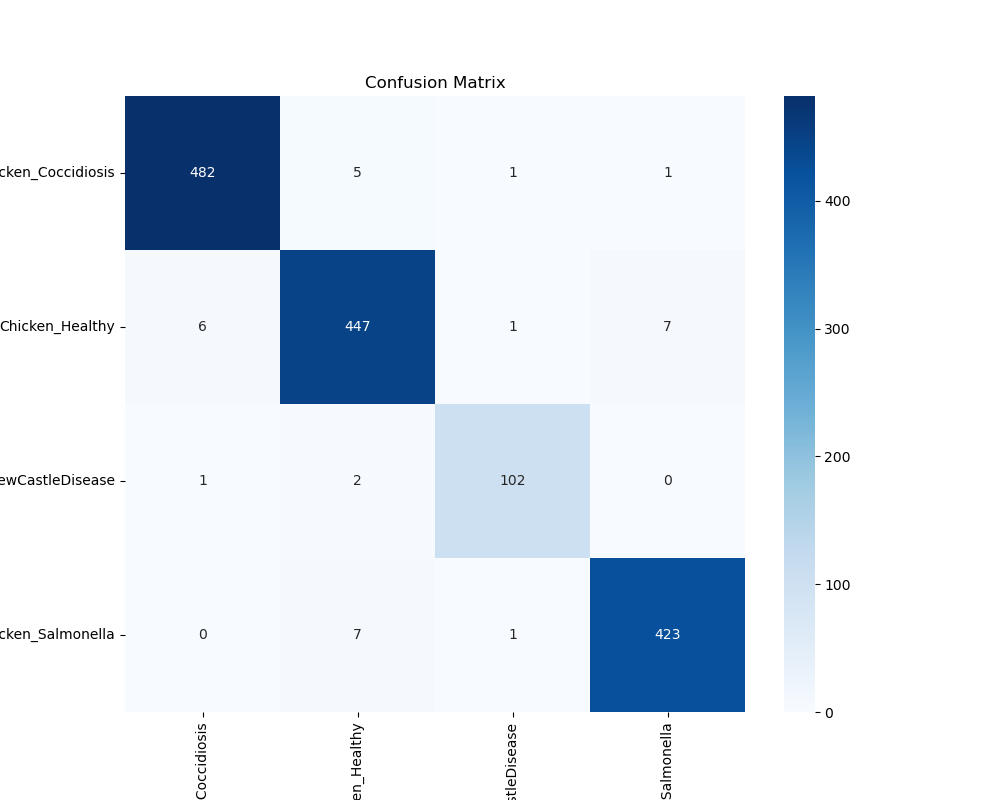

# Chicken Health Condition Classifier


A deep learning system for automated classification of chicken health conditions based on fecal images using Vision Transformer (ViT-B/16) architecture. This repository provides a solution for early detection of common poultry diseases, which is crucial for poultry farm management and disease control.

## Table of Contents

- [Overview](#overview)
- [Model Architecture](#model-architecture)
- [Dataset](#dataset)
- [Results](#results)
- [Installation](#installation)
- [Usage](#usage)
- [Project Structure](#project-structure)
- [Technical Details](#technical-details)
- [Future Improvements](#future-improvements)
- [License](#license)
- [Citation](#citation)

## Overview

This project implements a state-of-the-art Vision Transformer (ViT) model to classify chicken fecal samples into four categories: Coccidiosis, Healthy, Newcastle Disease, and Salmonella. Early detection of these conditions through non-invasive methods can significantly improve poultry farm productivity and animal welfare.

### Key Features

- **Transfer Learning**: Leverages pre-trained ViT-B/16 for efficient training
- **Two-Phase Training**: Head classifier training followed by fine-tuning of deeper layers
- **Data Augmentation**: Implements randomized transformations to enhance model robustness
- **High Accuracy**: Achieves 97.85% validation accuracy across all classes
- **Comprehensive Evaluation**: Provides confusion matrix and detailed classification metrics

## Model Architecture

The system utilizes Vision Transformer (ViT-B/16) architecture, which divides input images into 16×16 patches and processes them as sequence tokens through transformer encoders. This approach has proven highly effective for vision tasks and outperforms traditional CNNs in many classification scenarios.

- **Base Model**: ViT-B/16 pre-trained on ImageNet
- **Input Resolution**: 224×224 pixels
- **Feature Extraction**: 12 transformer encoder blocks
- **Classification Head**: Custom linear layer mapping to 4 health condition classes

## Dataset

The dataset consists of chicken fecal images categorized into four health conditions:

- **Chicken_Coccidiosis**: Fecal samples from chickens infected with coccidia parasites
- **Chicken_Healthy**: Fecal samples from healthy chickens
- **Chicken_NewCastleDisease**: Fecal samples from chickens with Newcastle Disease
- **Chicken_Salmonella**: Fecal samples from chickens infected with Salmonella bacteria

**Dataset Distribution:**
- Total Images: ~7,400
  - Coccidiosis: ~2,400 images
  - Healthy: ~2,330 images
  - Newcastle Disease: ~525 images
  - Salmonella: ~2,145 images

The dataset is split into 80% training and 20% validation sets.

## Results

Our model achieved exceptional performance metrics across all classes:

### Final Validation Metrics (After 15 Epochs)
- **Overall Accuracy**: 97.85%
- **Average Precision**: 98%
- **Average Recall**: 98%
- **Average F1-Score**: 98%

### Confusion Matrix


### Class-wise Performance
```
                          precision    recall  f1-score   support

     Chicken_Coccidiosis       0.99      0.99      0.99       489
         Chicken_Healthy       0.97      0.97      0.97       461
Chicken_NewCastleDisease       0.97      0.97      0.97       105
      Chicken_Salmonella       0.98      0.98      0.98       431

                accuracy                           0.98      1486
               macro avg       0.98      0.98      0.98      1486
            weighted avg       0.98      0.98      0.98      1486
```

### Training Progress


## Installation

1. Clone this repository:
```bash
git clone https://github.com/yourusername/chicken-health-vit-classifier.git
cd chicken-health-vit-classifier
```

2. Create and activate a virtual environment (optional but recommended):
```bash
python -m venv venv
source venv/bin/activate  # On Windows: venv\Scripts\activate
```

3. Install the required packages:
```bash
pip install -r requirements.txt
```

## Usage

### Training the Model

To train the model from scratch:

```bash
python train.py --data_path path/to/chicken_feces_dataset --epochs 10 --batch_size 16
```

### Inference on New Images

For classification of new images:

```bash
python predict.py --image_path path/to/image.jpg --model_path path/to/best_vit_chicken_model.pth
```

### Using Google Colab

For training using Google Colab's GPU:

1. Upload dataset to Google Drive
2. Mount Google Drive in Colab
3. Install the required packages
4. Adjust the `DATA_DIR` path to point to your dataset
5. Run the code as provided in the notebook

## Project Structure

```
chicken-health-vit-classifier/
│
├── train.py                  # Main training script
├── model.py                  # Model architecture definition
├── dataset.py                # Dataset and data loading utilities  
├── predict.py                # Inference script for new images
├── utils.py                  # Utility functions
├── requirements.txt          # Required packages
├── best_vit_chicken_model.pth # Pre-trained model weights
├── confusion_matrix.png      # Visualization of model performance
├── training_history.png      # Training and validation curves
└── README.md                 # Project documentation
```

## Technical Details

### Model Training

The training process consists of two phases:
1. **Phase 1**: Only the head classifier is trained while the backbone is frozen (5 epochs)
2. **Phase 2**: The last two transformer blocks and head classifier are unfrozen for fine-tuning (5-15 epochs)

### Hyperparameters

- **Batch Size**: 16
- **Learning Rate**: 
  - Phase 1: 1e-4
  - Phase 2: 1e-5
- **Image Size**: 224×224 pixels
- **Optimizer**: Adam
- **Loss Function**: CrossEntropyLoss
- **Data Augmentation**: 
  - RandomHorizontalFlip (p=0.5)
  - RandomVerticalFlip (p=0.2)
  - RandomRotation (±15°)
  - ColorJitter (brightness, contrast, saturation)

## Future Improvements

- Integration with mobile applications for on-farm diagnosis
- Expansion to more poultry disease categories
- Implementation of explainable AI techniques for veterinary guidance
- Development of a web-based API for remote diagnosis
- Testing on real-time video feeds for continuous monitoring

## License

This project is licensed under the MIT License - see the LICENSE file for details.

## Citation

If you use this work in your research, please cite:

```
@software{chicken_health_vit_classifier,
  author = {Your Name},
  title = {Chicken Health Condition Classifier Using Vision Transformer},
  year = {2025},
  url = {https://github.com/yourusername/chicken-health-vit-classifier}
}
```

---

